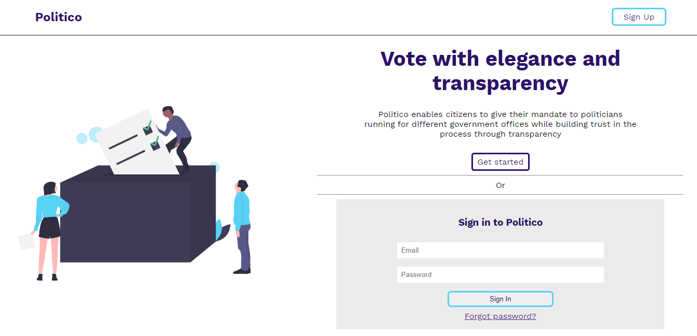

# Politico

 

Politico enables citizens to give their mandate to politicians running for different government offices
while building trust in the process through transparency.

## Built with

- HTML, CSS, JS
- Node JS
- Express JS
- PostgreSQL
- Babel JS
- Mocha and Chai

## Live demo

Click [here](https://blaise-shyaka.github.io/Politico/templates/) to view the live project

## Get Started

### Pre-requisites

- Node v12 and above
- npm v6 and above
- Code editor

### Setup and installation

- Clone this repository: `git clone https://github.com/Blaise-Shyaka/Politico.git`
- Install dependencies: `npm install`
- Run the server locally: `npm run dev`
- Run tests locally: `npm run test`

## Author

👤 **Blaise P. SHYAKA**
- Github: [Blaise-Shyaka](https://github.com/Blaise-Shyaka)
- Twitter: [@blaiseshyaka95](https://twitter.com/blaiseshyaka95)
- Linkedin: [Linkedin](https://linkedin.com/in/blaise-pascal-shyaka-b1340b111)

## Contributor:

👤 **Alain Burindi**
- Github: [alainburindi](https://github.com/alainburindi)
- Twitter: [@alainburindi](https://twitter.com/alainburindi)

## 🤝 Contributing

Contributions, issues and feature requests are welcome!

Feel free to check the [issues page](https://github.com/Blaise-Shyaka/Politico/issues).

## Show your support

Give a ⭐️ if you like this project!

## 📝 License

This project is [MIT](LICENSE) licensed.

